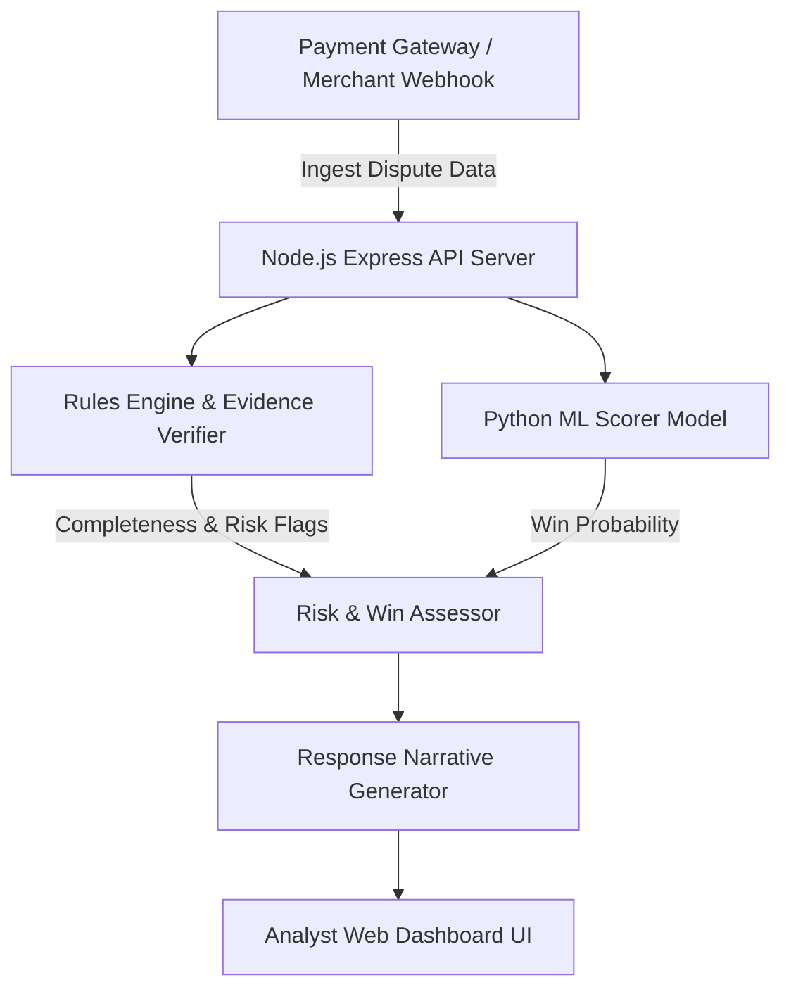

# Chargeback Sentinel 🛡️

[](https://github.com/bakhtiarsiddiqui/chargeback-sentinel/actions)
[](LICENSE)
[](https://nodejs.org/)
[](https://www.python.org/)
[](SECURITY.md)

> **Enterprise-Grade AI Chargeback Risk & Evidence Verification Platform.**  
> Predict dispute win probabilities, verify missing evidence, optimize merchant margin recovery, and automate defense narrative generation.

---

## 📋 Table of Contents
- [Executive Overview](#-executive-overview)
- [Key Features](#-key-features)
- [System Architecture](#-system-architecture)
- [Repository Structure](#-repository-structure)
- [Quick Start](#-quick-start)
- [Machine Learning Pipeline](#-machine-learning-pipeline)
- [API Reference Summary](#-api-reference-summary)
- [Security & Compliance](#-security--compliance)
- [Governance & Contributing](#-governance--contributing)
- [License](#-license)

---

## 🎯 Executive Overview

Chargeback Sentinel is an enterprise defense-only dispute engine designed for high-volume merchants, payment facilitators, and fintech platforms. 

By combining **deterministic 3DS/AVS/CVV evidence verification** with an **explainable Logistic Regression ML win probability scorer**, Chargeback Sentinel eliminates wasted analyst labor and prevents non-recoverable false-positive dispute contests.

---

## ✨ Key Features

- **⚡ Automated Dispute Risk Scoring**: Predict win probabilities based on 13 financial and behavioral signals.
- **🔍 Deterministic Evidence Verification**: Check 3DS 2.0 authentication, AVS/CVV matching, device fingerprinting, and geo-location consistency.
- **📊 Margin-Aware Recovery Calculator**: Balance expected dispute recovery values against analyst review costs (INR ₹150 + labor).
- **📝 Automated Response Narrative Generator**: Generate merchant defense narratives with evidence citations and submission checklists.
- **🖥️ Analyst Copilot Dashboard**: High-impact, real-time web interface for fraud analysts and dispute managers.
- **⚙️ Enterprise-Ready CI/CD**: Pre-configured GitHub Actions, Makefile automation, unit test suites, and audit logs.

---

## 🏗️ System Architecture



---

## 📂 Repository Structure

```
chargeback-sentinel/
├── .github/
│   ├── ISSUE_TEMPLATE/
│   │   ├── bug_report.md
│   │   └── feature_request.md
│   ├── PULL_REQUEST_TEMPLATE.md
│   └── workflows/
│       └── ci.yml
├── docs/
│   ├── api_reference.md
│   ├── architecture.md
│   └── ml_pipeline.md
├── src/
│   ├── engine/
│   │   └── engine.js            # Core JS domain & evaluation logic
│   ├── ml/
│   │   ├── features.py          # Feature transformation pipeline
│   │   ├── generate_data.py     # Stratified synthetic data generator
│   │   ├── score_dispute.py     # Logistic regression model trainer
│   │   ├── evaluate.py          # Held-out model evaluator
│   │   └── verify_evidence.py   # Deterministic evidence checker
│   ├── public/                  # Web Dashboard UI (HTML/CSS/JS)
│   └── server/
│       └── server.js            # Node.js REST API server
├── data/
│   ├── disputes.json            # Sample dispute records
│   └── ml/                      # Train/Val/Test CSV splits
├── tests/
│   ├── js/
│   │   └── engine.test.js       # Node.js unit tests
│   └── python/                  # Python ML test suites
├── .env.example
├── .gitignore
├── CHANGELOG.md
├── CONTRIBUTING.md
├── LICENSE
├── Makefile                     # Enterprise task runner
├── README.md
├── package.json
├── requirements.txt
└── SECURITY.md
```

---

## 🚀 Quick Start

### 1. Prerequisites
- **Node.js**: `>= 20.0.0`
- **Python**: `>= 3.10`

### 2. Installation
Clone the repository and install dependencies:
```bash
git clone https://github.com/bakhtiarsiddiqui/chargeback-sentinel.git
cd chargeback-sentinel
make install
```

### 3. Run Web Dashboard & API Server
```bash
make start
```
Open [http://127.0.0.1:3000](http://127.0.0.1:3000) in your browser.

### 4. Run Test Suites
```bash
make test
```

---

## 🤖 Machine Learning Pipeline

### Data Generation
Generates 1,200 synthetic dispute records stratified across `won`, `lost`, and `not_contested` labels with 24 tagged edge cases:
```bash
make generate-data
```

### Model Training
Trains the explainable Logistic Regression model:
```bash
make train-ml
```

### Evaluation
Evaluates precision, recall, weighted F1 score, and false-positive cost on held-out test splits:
```bash
make eval-ml
```

---

## 📡 API Reference Summary

| Endpoint | Method | Description |
| :--- | :--- | :--- |
| `/health` | `GET` | System health check and ISO timestamp |
| `/api/disputes` | `GET` | Priority dispute queue with live win scoring |
| `/api/disputes/:id` | `GET` | Single dispute deep-dive with draft response & audit trail |
| `/api/metrics` | `GET` | Global precision, recall, expected value, & false-positive metrics |
| `/score-dispute` | `POST` | Calculate win probability for raw dispute payload |
| `/verify-evidence` | `POST` | Validate evidence completeness and risk flags |
| `/draft-response` | `POST` | Generate merchant defense narrative and submission checklist |

*For detailed API payload schemas, see [docs/api_reference.md](docs/api_reference.md).*

---

## 🔒 Security & Compliance

- **PCI-DSS Compliance**: Designed to operate on tokenized transaction metadata without storing plain-text Primary Account Numbers (PANs) or card security codes (CVVs).
- **Data Protection**: Never commits environment secrets or live cardholder data. See [SECURITY.md](SECURITY.md) for vulnerability reporting.

---

## 🤝 Governance & Contributing

Contributions are welcome! Please review our [CONTRIBUTING.md](CONTRIBUTING.md) guide and adhere to our pull request workflows.

---

## 📄 License

Distributed under the MIT License. See [LICENSE](LICENSE) for details.
