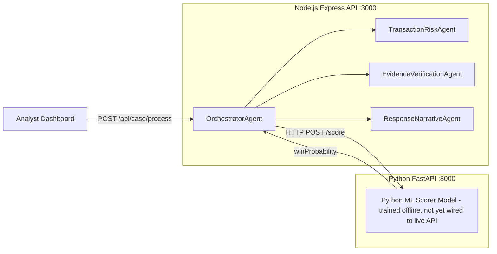

# Chargeback Sentinel 🛡️

[](https://github.com/bakhtiarsiddiqui/chargeback-sentinel/actions)
[](LICENSE)
[](https://nodejs.org/)
[](https://www.python.org/)
[](SECURITY.md)

> **Enterprise-Grade AI Chargeback Risk & Evidence Verification Platform.**  
> Multi-agent orchestration combining pre-transaction risk scoring, evidence verification, live ML win-probability inference, and automated defense narrative generation.

---

## 📋 Table of Contents
- [Executive Overview](#-executive-overview)
- [Key Features](#-key-features)
- [System Architecture](#-system-architecture)
- [Repository Structure](#-repository-structure)
- [Quick Start](#-quick-start)
- [Machine Learning Pipeline](#-machine-learning-pipeline)
- [API Reference Summary](#-api-reference-summary)
- [Security & Compliance](#-security--compliance)
- [Governance & Contributing](#-governance--contributing)
- [License](#-license)

---

## 🎯 Executive Overview

Chargeback Sentinel is an enterprise defense-only dispute engine designed for high-volume merchants, payment facilitators, and fintech platforms. 

Chargeback Sentinel currently runs deterministic 3DS/AVS/CVV evidence verification and heuristic scoring live in production. A separate, explainable Logistic Regression model is trained and evaluated (see `ml:train` / `ml:evaluate`) and is being integrated into the live pipeline.

---

## ✨ Key Features

- **🤖 Multi-Agent Orchestration**: Four specialized agents (TransactionRisk, EvidenceVerification, DisputeWinProbability, ResponseNarrative) coordinated by `OrchestratorAgent` with full audit trail.
- **⚡ Automated Dispute Risk Scoring**: Predict win probabilities based on 13 financial and behavioral signals via live FastAPI ML microservice.
- **🔍 Deterministic Evidence Verification**: Check 3DS 2.0 authentication, AVS/CVV matching, device fingerprinting, and geo-location consistency.
- **📊 Margin-Aware Recovery Calculator**: Balance expected dispute recovery values against analyst review costs (INR ₹150 + labor).
- **📝 Automated Response Narrative Generator**: Generate merchant defense narratives with evidence citations and submission checklists.
- **🛡️ Assistive Governance Mode**: Flags high-value (≥ ₹5,000) or low-confidence (< 60% win probability) cases for human analyst approval.
- **🖥️ Analyst Copilot Dashboard**: Real-time web interface with multi-agent audit timeline and pipeline execution.
- **⚙️ Enterprise-Ready CI/CD**: Pre-configured GitHub Actions, Makefile automation, unit test suites, and audit logs.

---

## 🏗️ System Architecture



**Two-Process Architecture**: The live pipeline requires both the Node.js Express server (`:3000`) and the Python FastAPI ML microservice (`:8000`). If the ML service is offline, the orchestrator gracefully falls back to the JS heuristic scorer.

See [docs/architecture.md](docs/architecture.md) for the full sequence diagram and agent responsibilities.

---

## 📂 Repository Structure

```
chargeback-sentinel/
├── .github/
│   ├── ISSUE_TEMPLATE/
│   │   ├── bug_report.md
│   │   └── feature_request.md
│   ├── PULL_REQUEST_TEMPLATE.md
│   └── workflows/
│       └── ci.yml
├── docs/
│   ├── api_reference.md
│   ├── architecture.md
│   └── ml_pipeline.md
├── src/
│   ├── engine/
│   │   ├── engine.js                # Core JS domain & evaluation logic
│   │   ├── orchestrator.js          # Multi-agent OrchestratorAgent
│   │   ├── transactionRiskAgent.js  # Pre-transaction risk agent
│   │   └── mlAdapter.js             # camelCase → snake_case ML feature bridge
│   ├── ml/
│   │   ├── features.py              # Feature transformation pipeline
│   │   ├── generate_data.py         # Stratified synthetic data generator
│   │   ├── score_dispute.py         # Logistic regression model trainer
│   │   ├── evaluate.py              # Held-out model evaluator
│   │   ├── service.py               # FastAPI ML microservice (DisputeWinProbabilityAgent)
│   │   └── verify_evidence.py       # Deterministic evidence checker
│   ├── public/                      # Web Dashboard UI (HTML/CSS/JS)
│   └── server/
│       └── server.js                # Node.js REST API server
├── data/
│   ├── disputes.json            # Sample dispute records
│   └── ml/                      # Train/Val/Test CSV splits
├── tests/
│   ├── js/
│   │   ├── engine.test.js           # Node.js unit tests
│   │   └── orchestrator.test.js     # Multi-agent orchestrator tests
│   └── python/                      # Python ML test suites
├── .env.example
├── .gitignore
├── CHANGELOG.md
├── CONTRIBUTING.md
├── LICENSE
├── Makefile                     # Enterprise task runner
├── README.md
├── package.json
├── requirements.txt
└── SECURITY.md
```

---

## 🚀 Quick Start

### 1. Prerequisites
- **Node.js**: `>= 20.0.0`
- **Python**: `>= 3.10`

### 2. Installation
Clone the repository and install dependencies:
```bash
git clone https://github.com/bakhtiarsiddiqui/chargeback-sentinel.git
cd chargeback-sentinel
make install
```

### 3. Train ML Model (required for live ML scoring)
```bash
make generate-data
make train-ml
```

### 4. Run Services

**Option A — API server only** (heuristic fallback if ML service is offline):
```bash
make start
```

**Option B — Full multi-agent pipeline** (both services):
```bash
# Terminal 1: ML microservice
make start-ml

# Terminal 2: API server & dashboard
make start

# Or start both together:
make start-all
```

Open [http://127.0.0.1:3000](http://127.0.0.1:3000), select a dispute, and click **Run Multi-Agent Pipeline**.

### 5. Run Test Suites
```bash
make test
```

---

## 🤖 Machine Learning Pipeline

### Data Generation
Generates 1,200 synthetic dispute records stratified across `won`, `lost`, and `not_contested` labels with 24 tagged edge cases:
```bash
make generate-data
```

### Model Training
Trains the explainable Logistic Regression model:
```bash
make train-ml
```

### Evaluation
Evaluates precision, recall, weighted F1 score, and false-positive cost on held-out test splits:
```bash
make eval-ml
```

---

## 📡 API Reference Summary

| Endpoint | Method | Description |
| :--- | :--- | :--- |
| `/api/case/process` | `POST` | Run full multi-agent orchestration pipeline |
| `/health` | `GET` | System health check and ISO timestamp |
| `/api/disputes` | `GET` | Priority dispute queue with live win scoring |
| `/api/disputes/:id` | `GET` | Single dispute deep-dive with draft response & audit trail |
| `/api/metrics` | `GET` | Global precision, recall, expected value, & false-positive metrics |
| `/score-dispute` | `POST` | Calculate win probability for raw dispute payload |
| `/verify-evidence` | `POST` | Validate evidence completeness and risk flags |
| `/draft-response` | `POST` | Generate merchant defense narrative and submission checklist |

*For detailed API payload schemas (including Python FastAPI `/score`), see [docs/api_reference.md](docs/api_reference.md).*

---

## ⚠️ Known Limitations

- **Synthetic Training Data**: The ML model is trained on 1,200 stratified synthetic dispute records — not live production chargeback data.
- **Two-Process Requirement**: Live ML scoring requires both the Node.js server and Python FastAPI microservice running simultaneously.
- **Heuristic Fallback**: When the ML microservice is unreachable, win probability falls back to the JS heuristic engine (logged in the audit trail).
- **Assistive Mode Only**: High-value or low-confidence cases are flagged for human approval; the system does not auto-submit dispute responses.

---

## 🔒 Security & Compliance

- **PCI-DSS Compliance**: Designed to operate on tokenized transaction metadata without storing plain-text Primary Account Numbers (PANs) or card security codes (CVVs).
- **Data Protection**: Never commits environment secrets or live cardholder data. See [SECURITY.md](SECURITY.md) for vulnerability reporting.

---

## 🤝 Governance & Contributing

Contributions are welcome! Please review our [CONTRIBUTING.md](CONTRIBUTING.md) guide and adhere to our pull request workflows.

---

## 📄 License

Distributed under the MIT License. See [LICENSE](LICENSE) for details.
