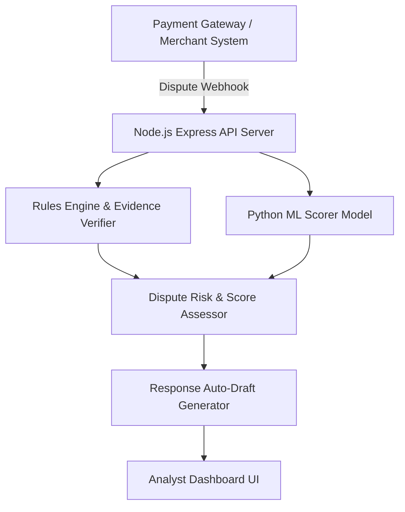

# System Architecture

## Overview
Chargeback Sentinel is built with a decoupled architecture designed for high throughput, explainable ML scoring, and evidence verification.

## Core Subsystems
1. **Node.js Express API Server (`src/server/server.js`)**:
   - Manages dispute queue ingestion, REST endpoint orchestration, and serving the single-page analyst web dashboard.
2. **Rules Engine (`src/engine/engine.js`)**:
   - Evaluates mandatory evidence requirements for specific dispute types (`product_not_received`, `fraudulent_transaction`, `digital_service`).
   - Computes expected margin recovery vs analyst review labor cost.
3. **ML Scorer Pipeline (`src/ml/`)**:
   - Trains an explainable Logistic Regression classifier using 1200 stratified synthetic records.
   - Extracts 13 numerical and boolean risk signals including 3DS auth, AVS/CVV matching, geo-consistency, and device fingerprint matching.
4. **Analyst Web Dashboard (`src/public/`)**:
   - Real-time priority queue dashboard with win probability badges, missing evidence checklists, and response draft generators.
