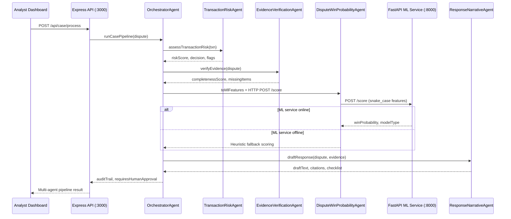

# System Architecture

## Overview
Chargeback Sentinel is a multi-agent orchestration platform that coordinates pre-transaction risk assessment, evidence verification, live ML win-probability inference, and defense narrative generation through an audit-logged `OrchestratorAgent`.

## Agent Responsibilities

| Agent | Role | Implementation |
| :--- | :--- | :--- |
| **TransactionRiskAgent** | Pre-transaction risk flags (₹5,000+ without 3DS, IP mismatch, device fingerprint, first-time high-ticket) | `src/engine/transactionRiskAgent.js` |
| **EvidenceVerificationAgent** | Deterministic evidence completeness and risk flag checker | `src/engine/engine.js` |
| **DisputeWinProbabilityAgent** | Live scikit-learn win probability via FastAPI microservice with heuristic fallback | `src/ml/service.py` + `src/engine/mlAdapter.js` |
| **ResponseNarrativeAgent** | Merchant defense narrative and submission checklist generator | `src/engine/engine.js` |
| **OrchestratorAgent** | Coordinates all agents, appends audit trail, enforces assistive governance | `src/engine/orchestrator.js` |

## Core Subsystems

1. **Node.js Express API Server (`src/server/server.js`)**:
   - Manages dispute queue ingestion, REST endpoint orchestration, and serving the analyst web dashboard.
   - Exposes `POST /api/case/process` to trigger the full multi-agent pipeline.

2. **Orchestrator & Domain Agents (`src/engine/`)**:
   - `orchestrator.js` sequences all four agents and evaluates `requiresHumanApproval` for assistive governance mode.
   - `transactionRiskAgent.js` applies transparent pre-transaction rule thresholds.
   - `mlAdapter.js` bridges camelCase dispute schemas to the Python ML service snake_case schema.

3. **Python ML Microservice (`src/ml/service.py`)**:
   - FastAPI service on port `8000` serving `POST /score` and `GET /health`.
   - Wraps the trained `model.pkl` Logistic Regression artifact from `score_dispute.py`.
   - If unreachable, the orchestrator falls back to the JS heuristic scorer without crashing.

4. **Analyst Web Dashboard (`src/public/`)**:
   - Priority queue with win probability badges, multi-agent audit timeline, and human-approval banners for high-value or low-confidence cases.

## Assistive Governance Mode

Cases are flagged with `requiresHumanApproval: true` when:
- Transaction amount is **≥ ₹5,000**, or
- ML win probability is **< 60%**

This enforces human-in-the-loop oversight for high-stakes dispute decisions.
